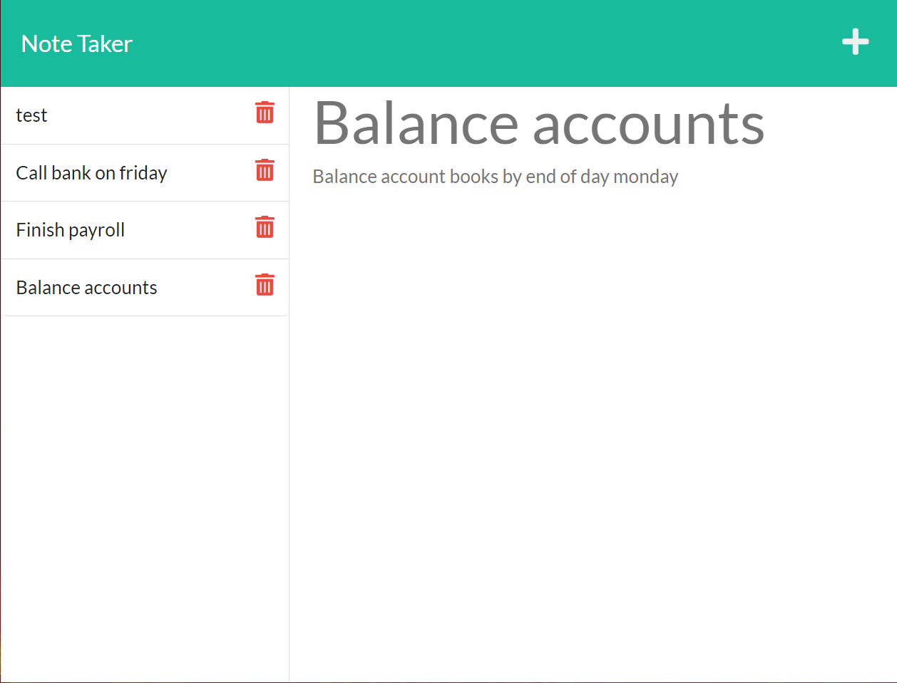

# ExpressNoteTaker

  
  
## Description
This is the 11th challenge for the UW Coding bootcamp. For this challenge, we had to follow acceptance criteria to create an HTML application that can be used to create and save notes. Express.js was required to save persistent data in JSON and FS was used to create and read files.
  
## Table of Contents
* [Description](#description)
* [Usage](#usage)
* [Questions](#questions)
  
## Usage
You can view the application [here](https://note-taker-express26.herokuapp.com/)

  
## Questions
Any Questions? Please reachout to me at Noahbrown2663@gmail.com
In addition, you can view this project and others on my [GitHub](https://github.com/Noahbrown26)
